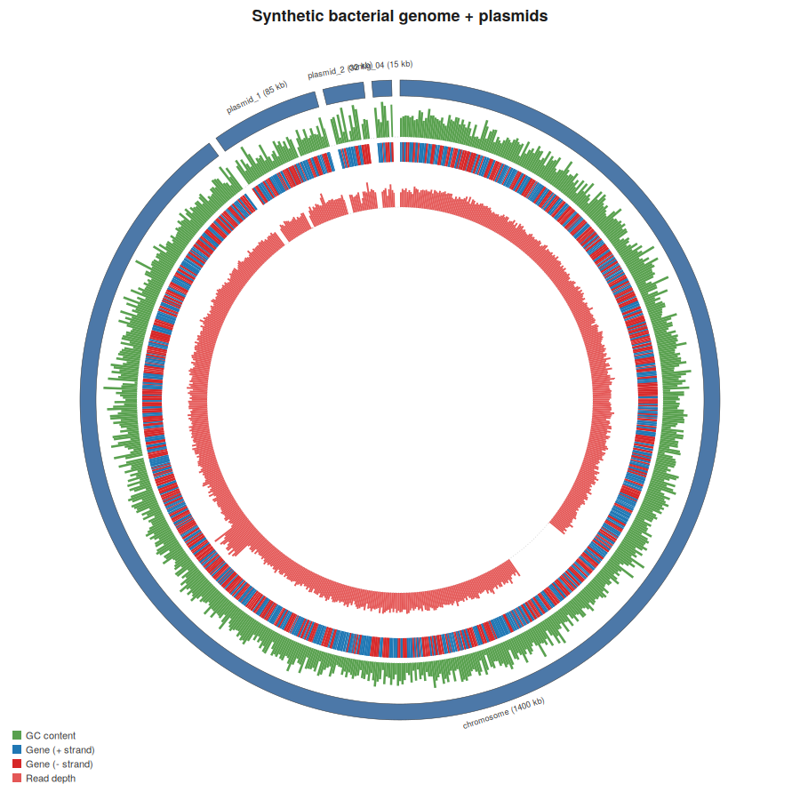
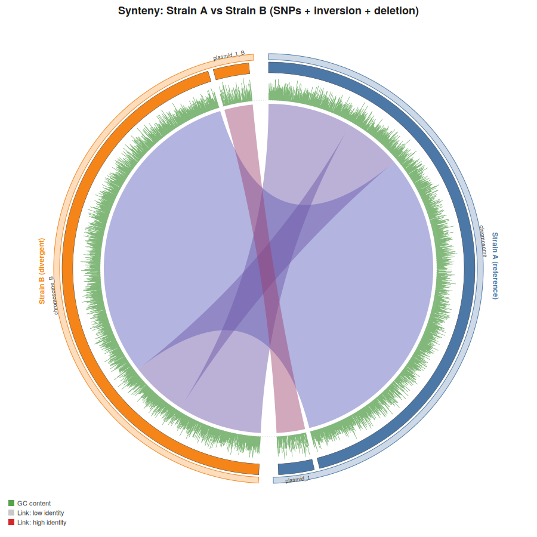
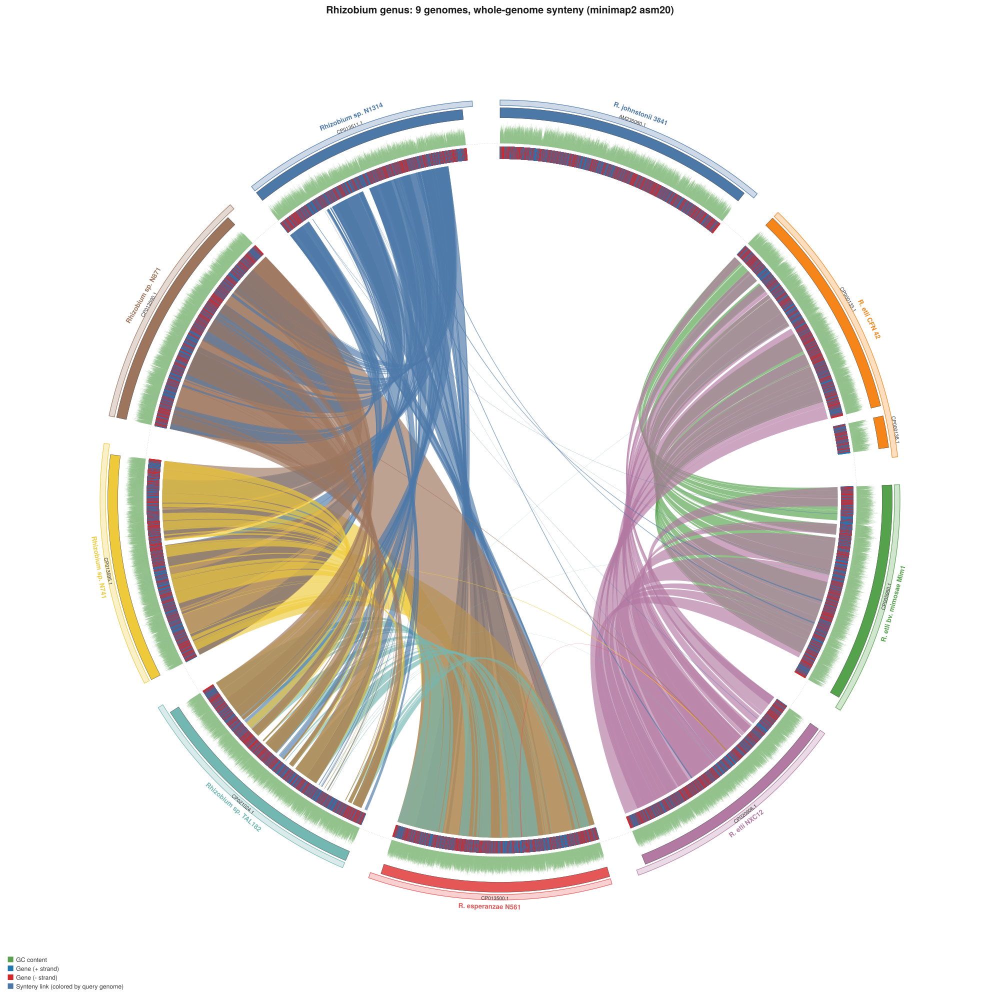

# circos-rs

A Rust CLI that draws Circos-style circular plots of bacterial genomes and
metagenome assemblies, directly from the files your pipeline already
produces:

- **FASTA** — the assembly (single genome or many-contig metagenome).
  Give it more than once (`--fasta a.fasta --fasta b.fasta ...`) for a
  **multi-genome synteny plot**.
- **GFF3** — gene/CDS annotations (optional)
- **BAM** — read alignments, for a depth/coverage ring (optional) — read
  with [`noodles`](https://github.com/zaeleus/noodles), a pure-Rust
  BAM/SAM library, so there's **no htslib and no `samtools` binary
  required** on the machine running this tool
  - or a plain `samtools depth`-style TSV, as an alternative to `--bam`
- **PAF** — pairwise alignments between genomes (minimap2's plain-text
  output format), for synteny/link ribbons in multi-genome mode

Output is a single self-contained SVG.






*Two divergent copies of the same synthetic chromosome + plasmid (2% SNPs,
one large inversion, one deletion), aligned with `minimap2 -x asm10` and
rendered with `circos-rs`. The crossing ribbon is the inversion; the gap
in the inner ring is the deletion.*

## Why

Existing circular-genome plotters (Circos itself, `circlize`, `pyCirclize`,
BioCircos.js, …) are excellent but are Perl/R/Python/JS. If you want this
step to live inside a Rust bioinformatics pipeline with no external runtime
or binary dependency, this fills that gap.

## Install / build

```
git clone <this repo>
cd circos-rs
cargo build --release
./target/release/circos-rs --help
```

### A note on the pinned dependency versions

This was built and tested against **Rust 1.75** (the version available via
`apt install cargo rustc` on Ubuntu 24.04). Recent releases of `indexmap`
and `clap` require the still-unstable `edition2024` Cargo feature, so
`Cargo.toml` pins them to the last versions that work on 1.75:

```toml
indexmap = "=2.2.6"
clap = { version = "=4.5.4", features = ["derive"] }
```

If you're building with a newer toolchain (1.85+), you can safely remove
those pins and let Cargo pick the latest compatible versions —
`cargo update` afterward.

## Usage

Ideogram + GC-content ring only:

```
circos-rs --fasta genome.fasta --out plot.svg
```

Add gene annotations (strand-colored):

```
circos-rs --fasta genome.fasta --gff genome.gff3 --out plot.svg
```

Add a read-depth ring straight from a BAM (no samtools needed):

```
circos-rs --fasta genome.fasta --gff genome.gff3 --bam reads.bam --out plot.svg
```

...or from a pre-computed depth file:

```
samtools depth -a reads.bam > depth.tsv
circos-rs --fasta genome.fasta --depth-tsv depth.tsv --out plot.svg
```

Metagenome assembly with thousands of small contigs — keep it readable by
plotting only the biggest ones:

```
circos-rs --fasta assembly.fasta --gff prokka.gff3 \
  --top-contigs 12 --min-contig-len 5000 \
  --title "MAG bin_07" --out bin07.svg
```

### Multi-genome synteny plots

Give `--fasta` more than once to compare genomes side by side, and add one
or more `--paf` alignment files to draw synteny/link ribbons between them.
Generate the PAF with minimap2's assembly-to-assembly preset:

```
minimap2 -x asm10 strainA.fasta strainB.fasta > aln.paf

circos-rs \
  --fasta strainA.fasta --label "Strain A (reference)" \
  --fasta strainB.fasta --label "Strain B" \
  --paf aln.paf \
  --min-align-len 1000 --min-identity 0.9 \
  --color-links-by identity \
  --title "Strain A vs Strain B" \
  --out synteny.svg
```

Each `--fasta` gets its own colored band and, in multi-genome mode, its
contigs are all colored the same as that band (so genomes read as distinct
blocks at a glance); `--label` sets the display name for each, in the same
order the `--fasta` flags were given. Use `asm5`/`asm10`/`asm20` in the
minimap2 preset for genomes that are roughly <1%/<5%/<10%–15% diverged;
for pairs from clearly different species, drop `-x asm*` and try `-x ava`
or a dedicated whole-genome aligner instead. Any number of genomes works —
alignments are matched to genomes automatically by contig id, so a single
`--paf` covering several pairwise comparisons (or several `--paf` files,
one per pair) both work; just make sure contig ids are unique across all
input genomes (a warning is printed if they collide).

Rows with `identity < 1.0` in the alignment naturally show up as thinner,
paler ribbons; `--color-links-by genome` instead colors every ribbon by
its query genome's band color (with opacity scaled by identity), which
reads better when you mainly care about *which genome* a region came from
rather than exact identity.

### All flags

| Flag | Default | Description |
|---|---|---|
| `--fasta <PATH>` | required | Assembly FASTA. Repeat for multiple genomes (enables synteny mode). |
| `--label <STR>` | file stem | Display label for each `--fasta`, same order. Repeatable. |
| `--gff <PATH>` | none | GFF3 annotations; draws a strand-colored gene ring. Repeatable (one per genome, or however many you have). |
| `--bam <PATH>` | none | BAM alignments; draws a read-depth ring (pure-Rust reader, no samtools). Repeatable — depth from all given BAMs is merged into one ring. |
| `--depth-tsv <PATH>` | none | `samtools depth`-style TSV, alternative to `--bam`. Repeatable. |
| `--paf <PATH>` | none | minimap2 PAF alignment file(s) for synteny ribbons. Repeatable. Requires ≥2 `--fasta`. |
| `--min-align-len <N>` | `1000` | Drop PAF alignments shorter than this (bp). |
| `--min-identity <F>` | `0.0` | Drop PAF alignments below this identity fraction (0.0–1.0). |
| `--max-links <N>` | all | Only draw the N longest alignments (readability/performance on dense PAFs). |
| `--color-links-by` | `genome` | `genome` (color by query genome, opacity ∝ identity) or `identity` (gray→blue→red scale). |
| `--out <PATH>` | `circos.svg` | Output SVG path |
| `--title <STR>` | `""` | Plot title |
| `--size <N>` | `900` | Canvas size (square, SVG user units) |
| `--window <N>` | `1000` | Window size (bp) for GC-content and depth binning |
| `--gap-degrees <N>` | `1.5` | Angular gap between contigs within one genome |
| `--genome-gap-degrees <N>` | `4.0` | Angular gap between genomes (multi-genome mode) |
| `--top-contigs <N>` | all | Only plot the N longest contigs *per genome* |
| `--min-contig-len <N>` | `0` | Drop contigs shorter than this |

`--bam` and `--depth-tsv` are mutually exclusive (pick one input style).

## How it works

- **`src/genome.rs`** — hand-rolled FASTA reader (contig ids, sequences,
  windowed GC-content). FASTA is simple enough that a full parsing crate
  wasn't worth the dependency.
- **`src/gff.rs`** — hand-rolled GFF3 reader (seqid/type/start/end/strand;
  keeps `gene`/`CDS` features).
- **`src/paf.rs`** — hand-rolled PAF reader (minimap2's pairwise alignment
  format) for synteny links between genomes.
- **`src/coverage.rs`** — depth-track construction. The BAM path decodes
  each record's CIGAR to find its true reference-consuming span (so
  soft-clips, insertions and deletions are handled correctly rather than
  approximated from read length) and bins per-base depth into fixed-size
  windows per contig. The TSV path bins a `samtools depth` file the same
  way.
- **`src/plot.rs`** — the rendering engine.
  - A `Layout` maps every `(contig, position)` to an angle. With one
    genome, contigs are laid end-to-end around the circle with a small gap
    between them (`gap_degrees`) — this is what keeps a 1000-contig
    metagenome from turning into an unreadable solid ring. With multiple
    genomes (`Layout::new_multi`), each genome first gets its own
    contiguous arc sized proportionally to its total length, separated by
    a bigger `genome_gap_degrees`, and *within* that arc its own contigs
    are laid out the same way as the single-genome case.
  - A `Canvas` draws each ring (ideogram / genome band / GC / genes /
    depth) as SVG annular-sector paths (`arc_band_path`) at that shared
    angle mapping, so every ring lines up regardless of how many genomes
    are involved.
  - `Canvas::link_ribbon` draws one synteny ribbon: two arcs (the aligned
    blocks) joined by two quadratic Béziers through the circle's center —
    the standard Circos "link" look. `identity_color` provides the
    gray→blue→red gradient for `--color-links-by identity`.
- **`src/main.rs`** — CLI (`clap`), wiring: load every `--fasta` → filter/
  sort each genome's contigs → build one shared multi-genome `Layout` →
  load GFF/BAM/depth-TSV/PAF inputs, matching each record to a genome by
  contig id → render rings outer→inner (genome band, ideogram, GC, genes,
  depth) → draw PAF-derived ribbons innermost → write SVG.
- **`src/bin/sam2bam.rs`** — a small dev-only helper (`sam2bam in.sam
  out.bam`) used to generate the BAM test fixture in `testdata/` without
  needing `samtools` installed; not part of the installed tool.

## Test fixtures

`testdata/genome.fasta` / `genome.gff3` / `reads.bam` — a synthetic
4-contig genome (one "chromosome" + three "plasmids") with GC content
varying by contig, ~2000 genes on alternating strands, and a BAM with a
seeded coverage gap and a coverage hotspot, for the single-genome rings:

```
cargo build --release
./target/release/circos-rs --fasta testdata/genome.fasta \
  --gff testdata/genome.gff3 --bam testdata/reads.bam \
  --title "demo" --out testdata/full.svg
```

`testdata/genomeA.fasta` / `genomeB.fasta` / `aln.paf` — two synthetic
strains sharing ancestry (genome B = genome A with 2% SNPs, one large
inversion, and one deletion introduced), pre-aligned with `minimap2 -x
asm10`, for the multi-genome synteny ring:

```
./target/release/circos-rs \
  --fasta testdata/genomeA.fasta --label "Strain A (reference)" \
  --fasta testdata/genomeB.fasta --label "Strain B (divergent)" \
  --paf testdata/aln.paf --color-links-by identity \
  --title "demo synteny" --out testdata/synteny.svg
```

`testdata/depth.tsv` is a small `samtools depth`-style fixture for
exercising the `--depth-tsv` path.

## Known limitations / ideas for extension

- Gene labels aren't drawn (only strand color) — add a `--label-genes`
  flag with a text ring for small genomes where that's still legible.
- Synteny links assume contig ids are unique across all input genomes
  (true for essentially all real assemblies); a collision prints a
  warning rather than failing, but the affected links/tracks may be
  ambiguous.
- Contig/genome labels can visually collide for many same-size small
  contigs; consider curved label paths or a leader-line/legend-table
  fallback below a configurable size threshold.
- `--depth-tsv` assumes 1-based positions (samtools' convention); a
  bedGraph (0-based, already-binned) reader would be a small addition.
- PAF is the only supported alignment format; a `.delta` (MUMmer) reader
  would be a natural addition for closely-related-genome comparisons
  where MUMmer/nucmer is the more common tool.

Gaurav Sablok \
gsablok@proton.me
